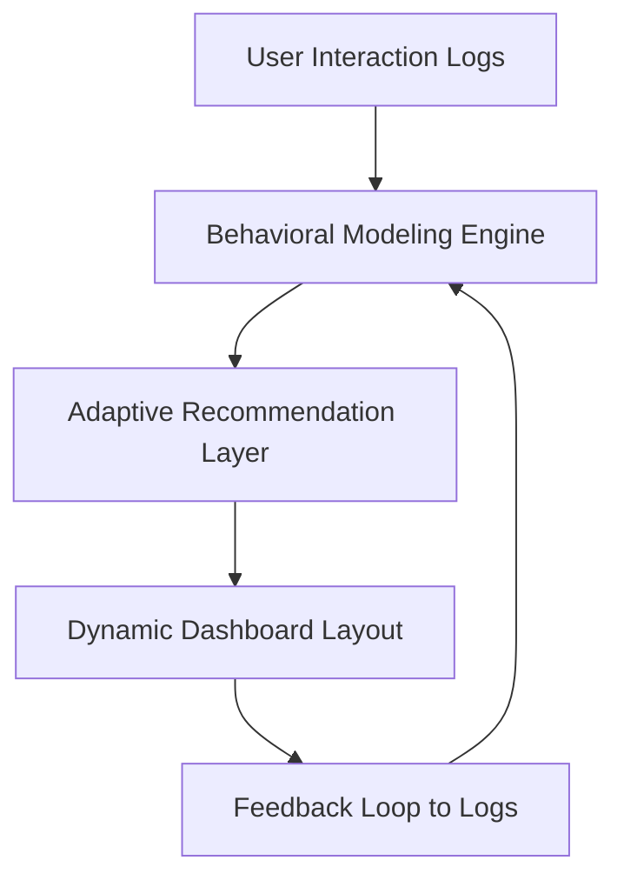

# The Analyst’s Mirror: When Dashboards Learn from Their Users

In an age when artificial intelligence powers predictions and automation, **data dashboards remain surprisingly one-dimensional**.  
They present, they calculate, they visualize, but they do not *adapt*.  
The next leap in analytics isn’t about more charts or faster databases. It’s about reflection: **dashboards that understand how analysts think, learn from their habits, and evolve accordingly.**

---

## Introduction, From Data Windows to Cognitive Mirrors

For decades, dashboards have been built as one-way interfaces windows into datasets.  
They let us look through the glass, but they never look back. Yet, every analyst leaves behind behavioral fingerprints: filter sequences, chart preferences, focus durations, and comparison patterns.  

What if dashboards could learn from that behavior?  
What if, instead of a blank slate every session, your analytics environment greeted you with **context-aware insights**, anticipating your questions before you even ask them?

This is the core of *The Analyst’s Mirror*: data systems that become **reflective partners** in reasoning.

---

## The Cognitive Gap, Where Dashboards Stop Thinking

Traditional BI systems (like Power BI, Tableau, or Looker) excel at descriptive and diagnostic analytics.  
But they miss the **cognitive continuity**, the way analysts mentally thread insights across sessions.  

Each time you reopen a dashboard, you restart your mental model. There’s no memory of your reasoning path, preferred KPIs, or analytic biases.  

> The cognitive gap is not a failure of visualization, it’s a failure of *attention design.*

Reflective dashboards aim to close that gap by learning how humans interact with data, not just what the data contains.

---

## Behavior as Data, The Hidden Feedback Layer

Every analytic interaction is a data point:  
- Which filters are applied most often.  
- How long users view anomaly charts.  
- Which KPIs trigger cross-section comparisons.  
- When users ignore recommendations.  

This **interaction stream**, often discarded, is a goldmine for personalization.  

By recording user behavior (ethically and transparently), dashboards can build a behavioral profile that drives adaptive intelligence.  
For instance:  
- Analysts who frequently examine “profit margins” alongside “marketing spend” may trigger correlation hints.  
- Users revisiting the same filters can be shown trend deltas automatically.  
- Time spent on forecast views can recalibrate model confidence intervals shown by default.

This is *data on data behavior*, analytics that evolve through observation.

---

## Reflective Architecture, Building Adaptive Analytics

A reflective system introduces a *behavioral learning layer* on top of the traditional BI stack.  
Here’s the flow:



### Key Layers

| Layer | Description |
|-------|--------------|
| **Interaction Logging** | Tracks non-sensitive UI behavior (filters, dwell time, metrics viewed). |
| **Behavioral Modeling** | Applies clustering or reinforcement learning to detect analysis patterns. |
| **Recommendation Engine** | Suggests metrics, insights, or layout adjustments dynamically. |
| **Narrative Generator** | Converts findings into text-based summaries (LLM-powered optional layer). |
| **User Feedback Loop** | Lets analysts accept, modify, or dismiss suggestions to refine learning. |

---

## Implementation Blueprint

Reflective dashboards can be implemented with widely available Python and analytics frameworks.  
A simplified blueprint:

```python
# Interaction Logging
interaction = {
    "user_id": 1,
    "timestamp": "2025-11-05T12:00:00",
    "filter_applied": "region='EU'",
    "metric_viewed": "revenue_growth",
    "duration_seconds": 42
}
log_to_sql(interaction)

# Behavioral Analysis
patterns = model.fit(interactions).find_common_sequences()
recommendations = engine.generate(patterns)

# Adaptive Display
if "forecast" in recommendations:
    show_chart("Sales Forecast", highlight=True)
```

This foundation creates a **loop of reflection**, where the system observes, adapts, and reconfigures its analytical responses.

---

## Cognitive Design, Empathy for the Analyst

The most advanced dashboards will not just adapt, they’ll empathize.  
Cognitive design involves anticipating how users think under uncertainty, fatigue, and bias.

### Design Principles
1. **Predictive Familiarity:** Use behavioral memory to make the dashboard feel “pre-understood.”  
2. **Contrastive Suggestion:** When the user fixates on one metric, offer counterbalancing perspectives.  
3. **Attention Recovery:** Detect prolonged inactivity and summarize key recent changes.  
4. **Bias Correction:** Highlight ignored variables or alternative causal paths.  
5. **Narrative Intelligence:** Offer human-readable summaries rather than just data outputs.

> The goal is not to automate analysis, but to **amplify cognition**.

---

## Comparative Frameworks, How Reflective Systems Differ

| Capability | Traditional BI | Reflective Analytics |
|-------------|----------------|----------------------|
| Memory | Session-based | Cross-session awareness |
| Adaptation | User-driven | System-assisted |
| Forecasting | Data-only | Context + User-pattern-informed |
| Personalization | Static dashboards | Behavior-based evolution |
| Narrative | Manual interpretation | Co-generated summaries |

---

## Case Study, The Reflective Workflow

Imagine a data analyst exploring a marketing dataset:  
1. They open the “Campaign ROI” dashboard.  
2. They apply filters for “Q3 2024” and “Web Channel.”  
3. They spend two minutes comparing CTR and revenue trends.  
4. They ignore “Customer Lifetime Value.”  

A reflective dashboard might then:  
- Recommend a follow-up chart showing **long-term retention impact** for the same segment.  
- Automatically load “Web Channel” as a default filter next session.  
- Summarize user behavior:  
  > “You focused primarily on CTR and revenue this week. Retention rate is up 8%, worth re-examining.”

This is **human-in-the-loop learning**, AI-powered reflection at the analyst level.

---

## Ethics, Transparency, and Trust

Adaptive intelligence demands ethical clarity.  
Reflective systems must maintain **full transparency**, giving users the power to:  
- View and clear their behavioral logs.  
- Control what the dashboard remembers.  
- Understand how recommendations are generated.  

Privacy is not optional, it’s part of the trust loop.  
Reflective analytics succeeds only if users believe the system *amplifies* their insight, not their surveillance.

---

## The Future, Symbiotic Analytics

The next era of analytics won’t be defined by data scale, but by **reflective depth**.  
Dashboards will become extensions of human reasoning, tools that recall not just data, but decisions, intent, and evolution.  

Soon, dashboards will:  
- Predict analytical curiosity.  
- Rebuild visual layouts in response to user behavior.  
- Generate adaptive stories explaining *why you care*.  

When that happens, the line between analyst and dashboard dissolves.  
The dashboard becomes a **mirror**, reflecting not only the data you analyze, but the way *you analyze data.*

---

## References

1. **Tufte, Edward R.** (2001). *The Visual Display of Quantitative Information.* Graphics Press.  
2. **Norman, Donald A.** (2013). *The Design of Everyday Things.* MIT Press.  
3. **Few, Stephen.** (2013). *Information Dashboard Design: Displaying Data for At-a-Glance Monitoring.* Analytics Press.  
4. **MIT Media Lab.** (2024). “Human-in-the-Loop Analytics Systems.”  
5. **Google Research.** (2023). “Designing Trustworthy AI Interfaces.”  
6. **Nielsen, Jakob.** (2020). *Usability Heuristics for Data-Centric Systems.* Nielsen Norman Group.  
7. **Stanford HCI Group.** (2025). “Reflective UX Design for Cognitive Workflows.”  
